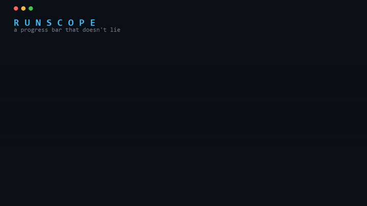

# RunScope

A progress bar that doesn't lie. Calibrated ETAs and completion intelligence for
long-running Python jobs.

[](https://github.com/GeoGizmodo/runscope/actions/workflows/ci.yml)
[](https://pypi.org/project/runscope/)

[](https://pypistats.org/packages/runscope)


<p align="center">
  
</p>

Ordinary progress bars assume the rest of your job looks like the part that already
ran. That assumption breaks exactly when it matters, which is when the expensive work
is at the end. RunScope gives you an honest range instead of a fake exact number, and
it learns your recurring jobs so each run's estimate gets better than the last.

## Install

```bash
pip install runscope
```

Free, local, zero dependencies. Pure standard library. No account, no network, no
config required.

## 30-second example

```python
import runscope

for item in runscope.track(items, key="my_job"):
    process(item)
```

```text
my_job |########------------| 38% 17492/48000 | 1h20m left (1h12m-1h31m) | high | [Padawan]
```

Drop-in replacement for tqdm:

```python
from runscope import trange
for i in trange(10000, key="my_job"):
    ...
```

## Why RunScope instead of tqdm?

tqdm is great, and RunScope is a drop-in for it. The difference is the ETA.

| | tqdm / plain bar | RunScope |
|---|---|---|
| ETA method | mean rate of items seen so far | size-weighted, recency-aware, with optional future sampling |
| Shows a range | no (one fake exact number) | yes (honest low-high interval) |
| Heavy tail at the end | badly under-estimates, then "hangs" | reacts, or predicts it up front by sampling |
| Learns recurring jobs | no | yes, calibrates automatically after ~3 runs |
| Extra dependencies | a few | none |

On heterogeneous or back-loaded workloads (where the cost is hidden from the early
items), a plain count-based bar is routinely 60 to 280 percent off. RunScope's
future-sampling cuts that to low single digits:

```text
shape           actual   plain bar   off   RunScope   off
heavy-tail        3.9s        1.6s   60%       3.9s    0%
heavy-middle      4.3s        1.3s   70%       4.3s    0%
heavy-front       4.3s       16.4s  278%       4.3s    1%
uniform           4.0s        4.0s    0%       4.0s    0%   (no harm on easy jobs)
random-spikes     3.6s        6.0s   64%       3.6s    3%
```

Reproduce it yourself: `python examples/demo_shapes.py`.

## The three modes (you never pick; it uses the best it can)

| mode | what it does | cost |
|------|--------------|------|
| Padawan | estimate from the current run (reacts to slowdowns) | free forever |
| Master | learns a recurring job after ~3 runs and calibrates | free forever |
| Jedi | samples a little of the upcoming work to predict heavy/uneven jobs | free through Sep 30, 2026, then Pro |

Padawan and Master are automatic. Jedi is opt-in: when you give RunScope a way to
measure item cost (measure_fn), it asks, before the run, what kind of workload this
is, and adapts. It samples the future for back-loaded or uneven jobs and stays on the
free current-run estimate for steady ones. It only asks on an interactive terminal;
scripts, CI, and notebooks are never prompted or blocked.

```python
for tile in runscope.track(tiles, key="satellite",
                           weight=lambda t: t.bytes,
                           measure_fn=lambda t: probe_cost(t)):
    process(tile)
# RunScope asks the workload question, then samples the future if it helps
```

Pass prompt=False to skip the question, or measure=True to force Jedi.

## What it's good at (and what it isn't)

RunScope is for enumerable work: loops over files, records, images, tiles,
simulations, parameter grids, API calls. That covers a huge amount of scientific and
data-processing work.

It does not try to predict the runtime of an arbitrary opaque operation with no
sub-steps and no history. When there isn't enough information to estimate honestly, it
says so instead of inventing a number. That restraint is on purpose.

## The science

RunScope's estimators come from a research program that tested dozens of ETA methods
against a simple baseline under preregistered pass/fail gates, and kept only what won
by a required margin. The core finding: for enumerable jobs, a size-weighted estimate
is very hard to beat, except by measuring a small sample of the unexecuted work, which
cut remaining-time error 40 to 90 percent on hard, heterogeneous workloads. That
measurement is Jedi mode.

Jedi is design-based sampling, not machine learning. It draws a small representative
sample of the remaining items (stratified by observable size, or systematically across
the run when sizes are uniform) and forms a Horvitz-Thompson estimate of the remaining
cost. Because the sample is chosen by design, the estimate is unbiased and comes with a
measurable margin of error rather than a blind guess. The approach applies the same
design-based and adaptive-cluster sampling ideas the author used for ecological
abundance estimation:

> Hariharan, Aneesh; Gallucci, Vincent; Heberer, Craig. Estimation of relative
> efficiency of adaptive cluster vs traditional sampling designs applied to arrival of
> sharks. arXiv:1304.2460 (2013).

The insight is the same in both settings: when the quantity you care about is
concentrated in places you haven't looked yet, a well-designed sample of the
unobserved population beats extrapolating from what you happened to see first.

## Examples

```bash
python examples/demo_full.py 3     # Jedi catches a hidden heavy tail
python examples/demo_full.py 1     # Padawan reacts as the tail hits
python examples/demo_shapes.py     # accuracy across workload shapes
```

## Pricing (after the free period)

Padawan and Master stay free, forever, offline. Jedi becomes part of RunScope Pro:

- Pro, 4 dollars per month: unlimited Jedi, cloud run history across machines, and
  job-finished or ETA-blowout alerts. Priced to cover cloud costs, not to get rich.

Nothing you can do today with Padawan or Master will ever be gated.

## Contributing and feedback

This is an early alpha and my first open-source release. Feedback, issues, and PRs are
very welcome.

## License

Apache-2.0.
